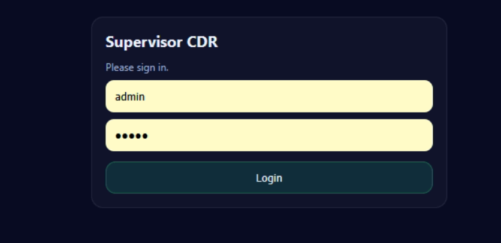
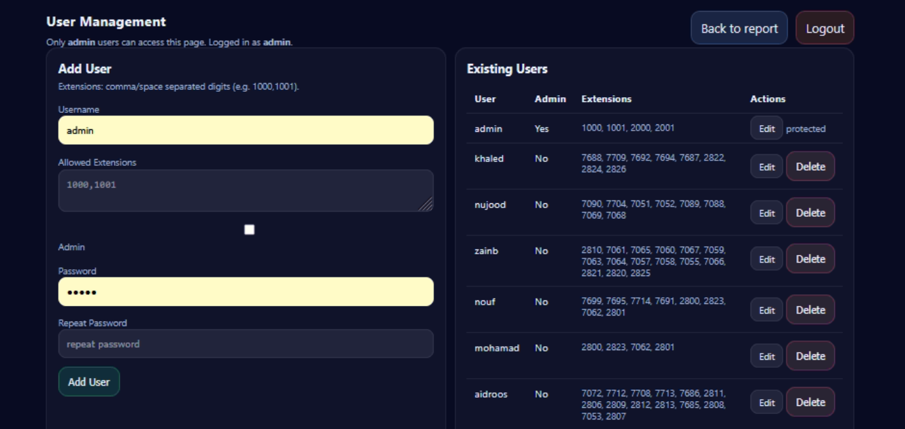

# Screenshots

## 🔐 Login Page

**Features:**
- Clean, modern login interface
- Secure session-based authentication
- Password protection with bcrypt hashing
- Responsive design for mobile and desktop

---

## 📊 CDR Dashboard

**Features:**
- Date range filtering
- Source/destination filtering
- Disposition filtering (Answered, No Answer, Busy, Failed, Congestion)
- Search across all CDR fields
- Interactive bar chart showing call totals
- Real-time statistics summary

---

## 📋 CDR Table View

**Features:**
- Sortable columns
- Call details with timestamps
- Duration tracking
- Caller ID display
- Channel information
- Recording playback/download (ACL enforced)
- CSV export functionality
- Responsive table design for mobile devices
- Per-user ACL filtering (users only see their assigned extensions)

---

## 👥 User Management (Admin Only)

**Features:**
- Add/edit/delete users
- Assign extensions to users
- Set admin privileges
- Change user passwords
- View user roles and permissions
- ACL configuration per user

---

## 📡 Extension Realtime Monitor

**Features:**
- Live call tracking with WebSocket updates
- Extension status indicators:
  - 🟢 Online - Extension registered and available
  - 🔴 Offline - Extension not registered
  - 📞 In-Call - Extension on active call
  - ⏸️ Paused - Extension paused from queue
  - ⏳ On-Hold - Call on hold
  - 🔵 Busy - Extension busy
- Active call details:
  - Caller ID name and number
  - Destination
  - Call duration (live timer)
  - Channel status
- Real-time updates (no page refresh)
- Connection status indicator
- Automatic reconnection on disconnect

---

## 📈 Extension KPI Dashboard

**Features:**
- Today's call statistics per extension
- Key Performance Indicators:
  - **THT** (Total Handle Time) - Total seconds on calls today
  - **AHT** (Average Handle Time) - Average call duration
  - **First Call Start** - Timestamp of first call today
  - **Last Call End** - Timestamp of last call today
- Total calls vs answered calls
- Extension status (Online/Offline/In-Call/etc.)
- Live WebSocket updates
- Sortable columns
- Responsive design

---

## 📞 Queue Realtime Monitor

**Features:**
- **Overall Summary Cards:**
  - Total number of queues
  - Total calls waiting across all queues
  - Available agents count
  - Busy agents count

- **Per-Queue Details:**
  - Queue name and status
  - Health indicator:
    - 🟢 Healthy - Adequate agents available
    - 🟡 Busy - More calls than available agents
    - 🔴 Critical - Calls waiting with no available agents
  - Longest wait time indicator
  - Available vs busy agent ratio

- **Calls in Queue Table:**
  - Position in queue
  - Caller ID information
  - Wait time (live countdown)
  - Color-coded wait time (red if > 60 seconds)

- **Queue Members Table:**
  - Extension number and name
  - Member status:
    - 🟢 Available - Ready to take calls
    - 📞 On Call - Currently on a call
    - ⏸️ Paused - Manually paused from queue
  - Calls taken count
  - Last call timestamp

- **Real-time Updates:**
  - Live WebSocket connection
  - Updates every second
  - Connection status indicator
  - Automatic reconnection

---

## 📱 Mobile Responsive Design

All pages are fully responsive and work on:
- Desktop computers
- Tablets
- Mobile phones

**Mobile Optimizations:**
- Stacked navigation buttons
- Collapsible filters
- Touch-optimized controls
- Responsive tables with mobile-friendly layout
- Card-based layout for queue monitoring

---

## 🎨 UI Theme

**Dark Mode Design:**
- Modern dark color scheme
- High contrast for readability
- Color-coded status indicators
- Glassmorphic card designs
- Smooth animations and transitions
- Professional gradient backgrounds

**Status Color Coding:**
- 🟢 Green - Online, Available, Healthy
- 🔵 Blue - Busy, Active
- 🟡 Yellow - Warning, High wait time
- 🔴 Red - Critical, Offline, Error
- ⚫ Gray - Paused, Inactive

---

## 🔄 Live Updates

All realtime pages feature:
- WebSocket-based push updates
- No page refresh required
- Connection status bar at top of page:
  - Green bar = Connected
  - Red bar = Disconnected
- "Last Update" timestamp
- Pulse animation on live elements
- Automatic reconnection with retry logic

---

## 🚀 Navigation

**Main Navigation Bar:**
- 📊 CDR Report - Historical call data and analytics
- 📡 Extensions Realtime - Live extension monitoring
- 📞 Queue Realtime - Live queue status
- 📈 Extension KPIs - Today's performance metrics
- 👤 User Management (Admin only)
- 🚪 Logout

All pages maintain consistent navigation for easy access to features.
